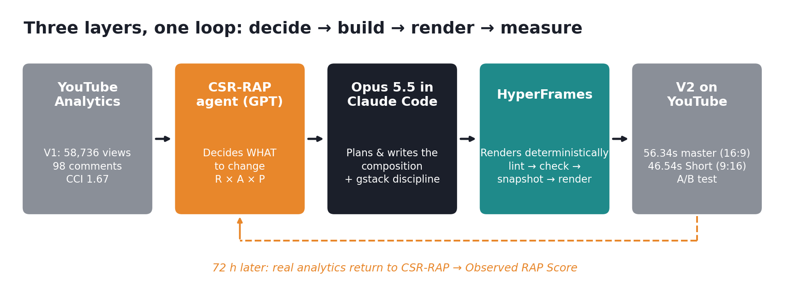
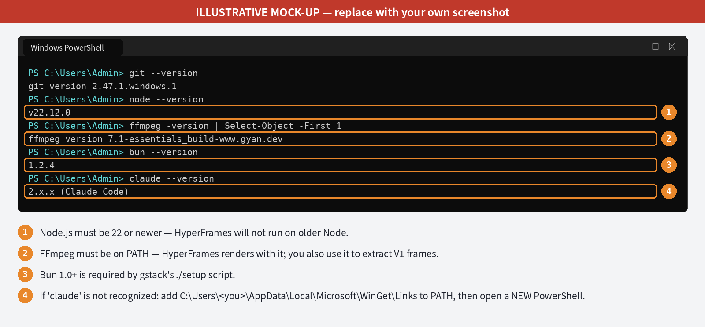
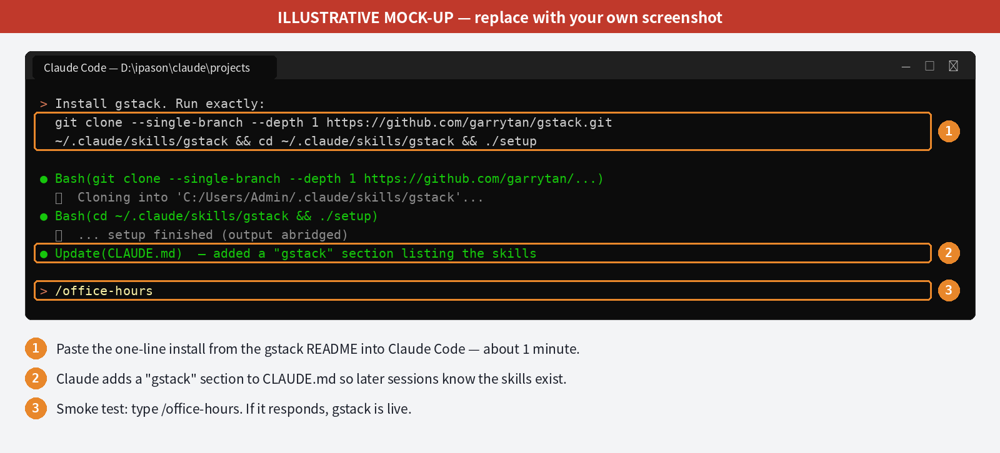
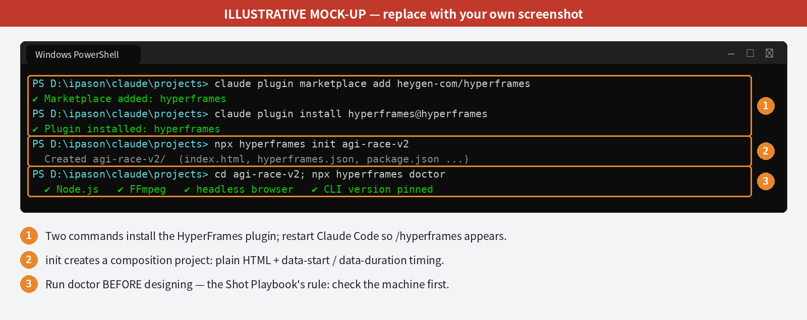
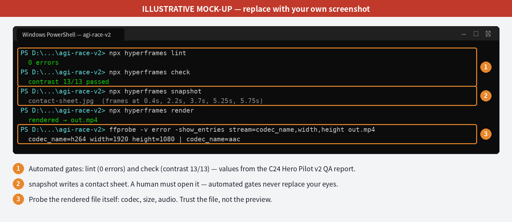
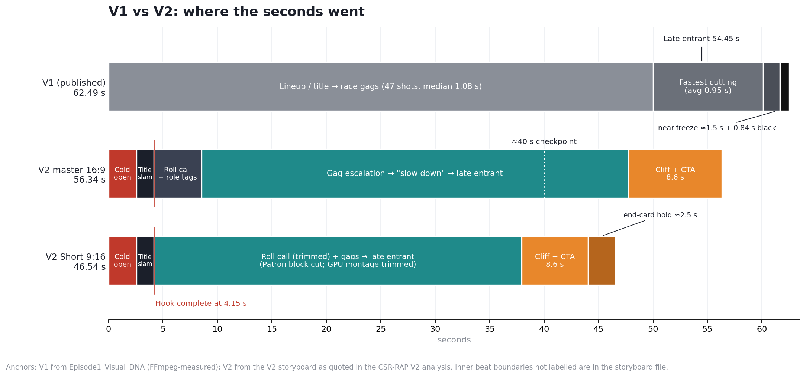
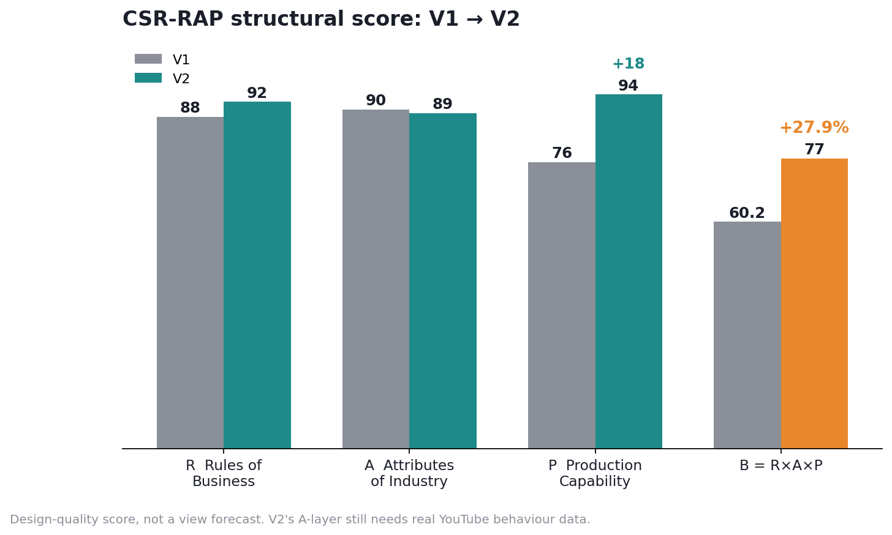

# gstack Tutorial #5 — From YouTube Analytics to a Re-engineered Short

### CSR-RAP agent × Claude Opus 5.5 × HyperFrames: how the AGI Race V2 was made

> 中文版：[TUTORIAL.zh.md](TUTORIAL.zh.md) · Word memo and slide deck: [`dist/`](dist/)

**What you will be able to do afterwards:** take a Short that is already on
YouTube, turn its real analytics into a quantified diagnosis (CSR-RAP), turn
that diagnosis into an executable brief for Claude Opus 5.5, and have Opus 5.5
rebuild the video *programmatically* with HyperFrames — then close the loop by
measuring the new version against the old one.

**Time:** about 10 minutes of setup (gstack alone takes about 1 minute) and
2–3 hours to read closely. The work it describes ran over one long day
(2026-09-28), across two Windows 11 PCs.

**Prerequisites:** Windows 11, a Claude subscription with Claude Code, a
YouTube channel with at least one published Short, and access to a CSR-RAP
analysis agent (the one used here is a custom GPT; any capable chat model
given the CSR-RAP framework can do this role).

**Scope, stated up front.** This tutorial is about **V2 of the AGI Race
Short**, a re-engineered version of the video that already has 58,736 views.
It is **not** about Episode 2 ("OpenAI vs. Anthropic — Mission: Impossible
Edition"), which is still in production and is not yet good enough to teach
from. Episode 2 appears only where its pilot taught us something about the
production system.

---

## Executive summary

**Governing thought:** *the leverage was not a better prompt; it was
splitting the work across three systems with different jobs.* A strategy
layer decides what to change, an agent layer writes the change, and a
deterministic render layer makes the change exactly, every time.



| Layer | Tool | Job | What it must never do |
|---|---|---|---|
| Decide | CSR-RAP agent (GPT) | Turn analytics into a ranked list of changes, with scores | Invent platform data it cannot see |
| Build | Claude Opus 5.5 in Claude Code, with gstack | Plan, write and verify the composition | Only write prompts for another generator and hope |
| Render | HyperFrames | Seek-safe HTML to MP4 rendering; timing, text, crop and audio exactly right | Be asked to invent photoreal humans |

**Three results:**

1. **The diagnosis was quantitative.** V1 scored R 88 × A 90 × P 76 →
   B = 0.602. The views proved the topic worked (R × A), but only
   1.67 comments per 1,000 views proved the conversion did not.
2. **The rebuild was structural, not cosmetic.** V2 moves the strongest
   punchline to 0 s, finishes the hook by 4.15 s, replaces name recognition
   with role tags, restages every shot for 9:16, and ends on a bridge to
   Episode 2. The master is 56.34 s (−9.8 %) and the Short 46.54 s (−25.5 %).
3. **The claim is still unproven where it matters.** CSR-RAP scores V2 at
   B = 0.770 (+27.9 % structural quality), but that is a design score.
   Whether viewers actually behave better is an open A/B test; Part 9 shows
   how to settle it.

---

## Part 0 — The mental model

**Governing lesson:** *generative AI creates uncertain pixels; HyperFrames
controls certain information. Put everything that must be 100 % right on the
certain side.*

The first attempt at a sequel treated Opus 5.5 as a prompt writer for a
text-to-video model. Each generation was a lottery ticket, which Chinese
creators call 抽卡 ("drawing cards"). You keep drawing until one looks right,
and nothing about the next draw is under control.

HyperFrames changes what can be controlled. A composition is plain HTML with
timing attributes (`data-start`, `data-duration`, `data-track-index`) and a
seekable animation timeline. The renderer **seeks a paused timeline to each
frame** and captures it; it does not record a page while it plays. That one
fact produces the rule this whole tutorial rests on:

> **The seek-safe test:** if the renderer jumps straight to t = 4.312 s
> without rendering any earlier frame, is the frame still correct?

Titles, captions, role tags, countdowns, crops, freezes, end-cards and audio
cue times all pass that test when written correctly. Faces and hands from a
video model do not. So the division of labour is:

| Must be exactly right → HyperFrames | May vary → generative model or source footage |
|---|---|
| Timing of every beat, to the frame | Photoreal characters and environments |
| All on-screen text, captions and role tags | Motion inside a shot |
| 9:16 reframing per shot | Texture and lighting detail |
| Freeze, black cut, end-card sequence | |
| Audio cue placement | |

V2 needed almost nothing from the right-hand column: its pixels already
existed in V1. That is why it was the right first project for this system.

**Checkpoint 0**
- [ ] You can state the seek-safe test from memory.
- [ ] You can say, for any element of a Short, which column it belongs in.

---

## Part 1 — Set up the toolchain on Windows 11 (about 10 minutes)

**Governing lesson:** *check the machine before you design anything.* The
HyperFrames Shot Playbook records a real rework caused by designing ambient
music before finding out the audio catalog was unavailable on that PC.

### 1.1 Prerequisites

Open **PowerShell** and install whatever is missing:

```powershell
winget install --id Git.Git -e
winget install --id OpenJS.NodeJS -e          # HyperFrames needs Node.js 22 or newer
winget install --id Gyan.FFmpeg -e            # HyperFrames renders with FFmpeg
powershell -c "irm bun.sh/install.ps1 | iex"  # gstack's setup needs Bun 1.0+
```

Close PowerShell, open a **new** window, and verify:

```powershell
git --version; node --version; ffmpeg -version | Select-Object -First 1; bun --version; claude --version
```



*All four screenshots in this tutorial are **illustrative mock-ups** with
annotation. Replace them with captures from your own PC before publishing a
fork.*

> **Windows pitfall we actually hit:** `'claude' is not recognized`. The
> WinGet install put Claude Code in
> `C:\Users\<you>\AppData\Local\Microsoft\WinGet\Links`, which was not on
> PATH. Fix once, then open a new PowerShell:
>
> ```powershell
> $p = "$env:LOCALAPPDATA\Microsoft\WinGet\Links"
> [Environment]::SetEnvironmentVariable("Path", [Environment]::GetEnvironmentVariable("Path","User") + ";$p", "User")
> ```

### 1.2 Install gstack (about 1 minute)

gstack is Garry Tan's open-source set of Claude Code skills. It turns one
Claude Code session into a virtual team: CEO review, engineering review,
design review, QA, security, release. In this project it supplies
**discipline**: challenging the premise, locking the plan and reviewing the
result.

Start Claude Code in your projects folder (`claude`), then paste this
instruction. It is the official one-line install from the gstack README:

```text
Install gstack: run
git clone --single-branch --depth 1 https://github.com/garrytan/gstack.git ~/.claude/skills/gstack && cd ~/.claude/skills/gstack && ./setup
then add a "gstack" section to CLAUDE.md that lists the available skills.
```

On Windows, Claude Code runs this through Git Bash, which is why Git is a
prerequisite. Smoke test: type `/office-hours`. If gstack answers, it is live.



### 1.3 Install HyperFrames

In PowerShell:

```powershell
claude plugin marketplace add heygen-com/hyperframes
claude plugin install hyperframes@hyperframes
```

Restart Claude Code; `/hyperframes` is now available. It is a **router**:
it reads the job and sends it to the right workflow. Per the Shot Playbook,
content under about 10 seconds with no narration, where the motion itself is
the message, goes to `/motion-graphics`. Longer, multi-scene work such as a
46–56 second Short goes to `/general-video`.

Create a project and run the doctor **before** any design work:

```powershell
npx hyperframes init agi-race-v2
cd agi-race-v2
npx hyperframes doctor
```



Pin the CLI version in `package.json` so the render is reproducible. The
project behind this tutorial pinned HyperFrames **0.8.79**.

### 1.4 Folder layout that worked

```text
D:\ipason\claude\projects\agi-race\
├── CLAUDE.md                        # gstack section + project rules
├── source\AGI_Race_V1.mp4           # the published V1 (read-only)
├── source\AGI_Race.srt
├── analysis\Episode1_Visual_DNA.md  # Part 3 output
├── analysis\Episode1_Visual_DNA\    # 24 labelled key frames
├── playbook\HyperFrames_Shot_Playbook.md
├── briefs\CSR-RAP_V1_diagnosis.md   # Part 2 output
└── agi-race-v2\                     # HyperFrames project (Part 6)
```

Protect the source: in Claude Code, `/freeze agi-race-v2` limits edits to
the new project, so V1 and the analysis files cannot be changed by accident.

**Checkpoint 1**
- [ ] `node --version` shows v22 or newer; `ffmpeg` and `bun` resolve.
- [ ] `/office-hours` responds (gstack live).
- [ ] `/hyperframes` responds and `npx hyperframes doctor` is clean.

---

## Part 2 — Raw analytics → CSR-RAP diagnosis

**Governing lesson:** *views tell you the topic worked; conversion tells you
whether the product did.* Read both.

### 2.1 What to export

From **YouTube Studio → the video → Analytics**, record:

| Short (9:16) | Long-form / 16:9 |
|---|---|
| Views, Shown in feed | Impressions, CTR |
| Viewed vs. swiped away (Stayed to watch %) | Average view duration (AVD) |
| Average view duration, Average percentage viewed | Retention curve |
| Likes, Comments, Shares, Subscribers gained | Subscribers gained |

For V1 we had the two numbers the channel owner reported: **58,736 views and
98 comments**, the channel's first breakout. We derive one metric from them
and track it from here on:

$$\text{CCI (Comment Conversion Index)} = \frac{\text{Comments}}{\text{Views}} \times 1000 = \frac{98}{58{,}736}\times1000 = 1.67$$

### 2.2 Run the CSR-RAP agent

CSR-RAP scores a business result as the product of three layers:
**R** (Rules of Business, the laws any product must obey), **A** (Attributes
of Industry, the structure of this market, here YouTube Shorts), and **P**
(Personality, the creator's own production capability). Because
**B = R × A × P**, one weak layer caps the whole result.

Paste the full prompt in [`starter/prompts/01_csr_rap_diagnosis.md`](starter/prompts/01_csr_rap_diagnosis.md)
into your CSR-RAP agent. It is the actual prompt used for V1: title,
description, chapter timestamps, featured people and the two numbers above.

### 2.3 What came back

| Layer | V1 score | Diagnosis |
|---|---|---|
| R — Rules of Business | 88 | Cognitive compression works: a complex AI race became a desert race |
| A — Attributes of Industry | 90 | Hot topic, recognisable personalities, strong Shorts fit |
| P — Production capability | 76 | Good visual continuity and escalation, but weak causality and poor 9:16 behaviour |
| **B = R × A × P** | **0.602** | **R × A resonance is proven; conversion (1.67 CCI) is not** |

**Checkpoint 2**
- [ ] You can compute CCI for any of your videos.
- [ ] You can explain why a multiplicative score punishes the weakest layer.

---

## Part 3 — Measure V1 before you change it: the Visual DNA

**Governing lesson:** *you cannot keep what works unless you have measured
it.* "Make it better" is not a brief. "Keep the 0.95 s cutting block before
the climax; fix the four things that break in 9:16" is.

Ask Opus 5.5, in Claude Code, to profile V1 with FFmpeg. The prompt is in
[`starter/prompts/02_visual_dna.md`](starter/prompts/02_visual_dna.md). The
core commands it runs look like this:

```powershell
# technical profile
ffprobe -v error -show_entries format=duration:stream=codec_name,width,height,r_frame_rate source\AGI_Race_V1.mp4
# hard-cut detection (scene score > 0.3), with timestamps
ffmpeg -i source\AGI_Race_V1.mp4 -vf "select='gt(scene,0.3)',showinfo" -vsync vfr -f null - 2> analysis\cuts.log
# one candidate frame per second for review
ffmpeg -i source\AGI_Race_V1.mp4 -vf fps=1 analysis\candidates\f_%03d.jpg
```

What the Visual DNA found (all FFmpeg-measured):

| Dimension | Finding | Consequence for V2 |
|---|---|---|
| Length | 62.49 s | Room to cut ≈6 s from the master and ≈16 s from the Short |
| Rhythm | 46 hard cuts / 47 shots; median shot 1.08 s; 20 of 46 under 1 s | Keep the fast grammar |
| Climax | Fastest block ≈50–60 s, mean shot 0.95 s | Keep acceleration before the payoff |
| Ending | ≈1.5 s near-freeze from 60.1 s, then 0.84 s black | Near-freeze + black is the target ending |
| Colour | Muted (saturation ≈9–20); green GPU beam the only strong accent | Keep the restraint |
| 9:16 | Centre crop cuts the title, the wide ensemble, the final freeze and **every subtitle**; close-ups survive | 9:16 must be re-directed, not cropped |
| Counterforce | "Slow down" plays as the biggest close-up, just before the climax | Keep it as the last beat before the climax |

One rule was also set here and carried into V2: **characters are recorded by
role, not by real name.**

**Checkpoint 3**
- [ ] You have a Visual DNA file with measured rhythm, ending and 9:16 findings.
- [ ] Every V2 change you plan can be traced to a line in it.

---

## Part 4 — The detour that taught the lesson

**Governing lesson:** *an agent that only writes prompts for another
generator is still gambling.* This Part is included because the failure was
more instructive than a clean run would have been.

The first sequel plan (Episode 2) had Opus 5.5 produce a rigorous package:
shot prompts, continuity bible, pilot plan and scorecards. Run on the home
PC, it stopped at its own gate:

> *"Entry gate: FAIL. Nothing has been generated yet. The project folder has
> no reference images, so none of the entry conditions can be scored…
> Numbers for frames nobody has generated would be invented."*

Two things are worth noticing. First, **the gate worked**: Opus refused to
fill in scores for footage that did not exist, which is the behaviour you
want. Second, the plan's dependency on generated faces made the whole
pipeline wait on the least controllable step.

The pivot: install HyperFrames and let Opus **build** instead of **prompt**.
The first HyperFrames short (6 s, 1920×1080, 30 fps, 5 audio tracks,
rendered in 15.6 s) and the later C24 structure pilot proved the controlled
layer works. In C24, jumping straight to 2.4 s, 3.4 s, 4.5 s and 5.3 s
showed the correct countdown with no earlier playback, the black cut
landed on frame 139, lint reported 0 errors and check passed contrast 13/13. The same pilot also showed the limit: **R 0.82 and
A 0.75 were held back by placeholder characters, not by structure.** The
generative layer was still the risk.

That is what made V2 the right next move: a project where the pixels already
exist and every change is on the controllable side.

**Checkpoint 4**
- [ ] You can explain why "Entry gate: FAIL" was a success of the process.
- [ ] You can name which layer held the C24 pilot's score back.

---

## Part 5 — The HyperFrames Shot Playbook: rules that are now hard-coded

**Governing lesson:** *write down what went wrong once, so the agent can
never do it twice.* The Playbook came out of the first real HyperFrames
short, and its rules now go into every Opus 5.5 brief.

| # | Rule | Why |
|---|---|---|
| 1 | Route through `/hyperframes` first; ≤10 s motion pieces → `/motion-graphics`, multi-scene → `/general-video` | The router knows the right workflow |
| 2 | Run `doctor` and read the timeline before designing | Avoids designing for assets the machine can't use |
| 3 | Search the catalog before building (e.g. `titlecard-lockup` was reused, not rewritten) | Reuse beats re-invention |
| 4 | Every state must be correct at any seek time: no wall-clock counters, no Web Audio graphs, no second `fromTo` that fights the first | The renderer seeks; it does not play |
| 5 | Long holds (>≈4 s) get one monotonic micro-motion (e.g. scale 1 → 1.008), never a loop or yoyo | A dead-still frame reads as a freeze-up |
| 6 | Critical typography sits in the centre third | It must survive the 9:16 crop |
| 7 | Verification chain: **lint → check → snapshot/contact sheet → render → ffprobe**, then a human opens the contact sheet | Automated gates never replace eyes |



Keep one more fact from the C24 QA in mind: a second render matched the
first in 61 of 144 frames, and the other 83 differed by an invisible amount
(≥50 dB PSNR). The output is **visually deterministic, not bit-identical**.
Do not build a QA step that expects identical hashes.

**Checkpoint 5**
- [ ] Your project's `CLAUDE.md` contains these seven rules.
- [ ] You know which gate is the human one.

---

## Part 6 — The V2 brief for Opus 5.5

**Governing lesson:** *give the agent the measurements, the rules and the
stop conditions, and the creative decisions become checkable.*

### 6.1 Challenge the premise first (gstack)

Before the build prompt, spend ten minutes in gstack:

```text
/office-hours      → Is V2 worth making, or should all effort go to Episode 2?
                     What single question must V2 answer? (Answer used:
                     "Does HyperFrames packaging convert the same content into
                     better audience behaviour?")
/plan-ceo-review   → Scope: HOLD. Re-edit only; no new generated footage.
/plan-eng-review   → One shared token/typography system feeding two
                     compositions (16:9 master, 9:16 Short).
```

This does not change what HyperFrames renders. It prevents the most
expensive mistake, which is building the wrong V2 well.

### 6.2 The build prompt

The complete, copy-paste prompt is in
[`starter/prompts/03_opus55_v2_build.md`](starter/prompts/03_opus55_v2_build.md).
Its structure:

| Section | Content |
|---|---|
| Role and goal | Senior Shorts editor and HyperFrames engineer; re-engineer V1, no new generated footage |
| Inputs | V1 MP4 + SRT, Visual DNA, Shot Playbook, CSR-RAP diagnosis |
| Change list (from CSR-RAP) | Cold open on the strongest punchline; title slam by 4.15 s; role tags; delete unintelligible lines; separate 9:16 direction; Episode 2 bridge end-card |
| Keep list (from Visual DNA) | Fast grammar; acceleration before the climax; "slow down" as the biggest close-up; unresolved jump; near-freeze → black |
| Hard rules | The seven Playbook rules |
| Outputs | Storyboard, 16:9 master, 9:16 Short, QA report, contact sheets |
| Stop conditions | Stop after both renders and the QA report; do not upload; flag every staging change for human sign-off |

### 6.3 What the build produced

- A **43-shot master** (16:9, 56.34 s) and a **35-shot Short** (9:16, 46.54 s).
- **Per-shot vertical direction**: each shot has its own horizontal offset,
  group shots use a pan, the title is restacked into three lines, captions
  sit at 60 % height, a series header sits in the top bar, and the bottom and
  right edges are kept clear for platform UI.
- A **role-tag system** (THE GPU DEALER, THE LITIGATOR, THE ACCELERATOR, THE
  SAFETY GUY, THE OPEN-SOURCE GUY, THE LATE ENTRANT), so viewers do not need
  to recognise anyone to follow the story.
- **Audio seam crossfades**, a letterbox system, reusable tokens and a
  sequenced end-card: *TO BE CONTINUED → EPISODE 2 → SUBSCRIBE*.

After the build, run `/review` (gstack) on the composition code. It is
ordinary HTML/JS and gets the same bug review as any other code.

**Checkpoint 6**
- [ ] Your brief has a change list and a keep list, each traceable to a source.
- [ ] Your brief says when the agent must stop.

---

## Part 7 — V2 anatomy: the timing diagrams

**Governing lesson:** *the hook is a budget.* V2 spends 8.9 % of the Short
(4.15 s of 46.54 s) delivering spectacle, a punchline and a premise, in
that order.



The order changed from **context → joke** to **joke → curiosity → context**:

| Segment | V2 time | What the viewer gets |
|---|---|---|
| Cold open | 0–2.55 s | The strongest punchline first: *"Eat my lawsuits, nonprofit boy!"* |
| Title slam | 2.55–4.15 s | The premise: this is the AGI race, played as satire |
| Roll call | 4.15–8.53 s | Every player, labelled by role |
| Escalation | 8.53 s → | Gags build; "slow down" counterforce; the late entrant |
| Cliff + CTA | last 8.6 s | Unresolved jump → *TO BE CONTINUED → EPISODE 2 → SUBSCRIBE* |

### V1 → V2 improvement map

| Metric | V1 | V2 | Assessment |
|---|---|---|---|
| Main runtime | 62.49 s | 56.34 s | −9.8 % |
| Short runtime | — | 46.54 s | −25.5 % vs V1 |
| Opening | Lineup / title | Strongest gag first | Clear upgrade |
| Hook complete | Slower | 4.15 s | Stronger |
| English accessibility | Low | English captions and tags | Major upgrade |
| Role comprehension | Relies on recognition | Explicit role tags | Major upgrade |
| 9:16 | Fails in several places | Shot-by-shot reframing | Major upgrade |
| Ending | Unresolved jump | Unresolved jump + Episode 2 bridge | Commercial upgrade |
| CTA system | Weak / generic | TO BE CONTINUED → Episode 2 → Subscribe | Clear upgrade |
| Production | Video generation | Programmable HyperFrames re-edit | P upgrade |

**The Short is a separate product, not a crop.** What it removed was chosen,
not averaged: some roll-call shots, the whole Patron block and part of the
GPU montage. It keeps the causal chain intact:
**hook → rivals → gags → safety counterforce → late entrant → cliff.**

**Checkpoint 7**
- [ ] You can draw your own video's timing bar with the hook boundary marked.
- [ ] You can say what the Short cut and why the story still holds.

---

## Part 8 — Re-score with CSR-RAP (and read the score honestly)

**Governing lesson:** *a design score is a hypothesis about behaviour, not
evidence of it.*



| Layer | V1 | V2 | Why it moved |
|---|---|---|---|
| R — Rules of Business | 88 | 92 | Joke-first order; role tags remove the recognition requirement; dead lines removed |
| A — Attributes of Industry | 90 | 89 | Better Shorts structure, but CTA length is untested; the score is held back until data arrives |
| P — Production capability | 76 | 94 | Analyse → extract DNA → redesign → render, instead of prompt → hope |
| **B** | **0.602** | **0.770** | **+27.9 % structural quality** |

$$B_{V2} = 0.92 \times 0.89 \times 0.94 = 0.770$$

The most important change is *which pair of layers is strongest*. For V1 it
was R × A: picking a hot topic. For V2 it is **R × P = 0.865**: knowing what
viewers respond to *and* having a system that can repackage content to match.
That second advantage compounds across episodes; the first does not.

What +27.9 % does **not** mean: that V2 will get 27.9 % more views.

**Checkpoint 8**
- [ ] You can recompute B for V1 and V2 by hand.
- [ ] You can explain the difference between a design score and an observed score.

---

## Part 9 — Close the loop: measure, don't re-edit

**Governing lesson:** *two uploads of the same content are a natural
experiment. Don't spoil it by editing.*

V2 went up twice: the 9:16 Short (`youtube.com/shorts/mEztESwn7mI`) and the
16:9 master (`youtu.be/6MnhRmSR_TA`). The single question they answer:

> **Does HyperFrames packaging convert the same underlying content into
> better audience behaviour?**

**Rule 1: freeze both files for 24–72 hours.** Then collect the Part 2.1
metrics for each.

**Rule 2: check three time windows on the retention curve.**

| Window | Question | If it fails |
|---|---|---|
| 0–4.15 s | Does the cold open stop the swipe? | Test a different opening punchline |
| ≈40 s | Does "slow down → late entrant" lift attention again? | Tighten the escalation block before it |
| Last 8.6 s | Does the cliff + end-card add subscribers, or cause early exits? | If there is a retention cliff at the end-card **and** subscriber conversion does not improve, cut the end-card hold from ≈2.5 s to ≈1–1.5 s |

**Rule 3: replace judged scores with an Observed RAP Score.** The CSR-RAP
agent names five measures. The definitions below are a **proposed**
operationalisation; confirm them with your agent before you rely on them:

| Measure | Proposed definition |
|---|---|
| Hook efficiency | Stayed-to-watch % (Short) or CTR (16:9) |
| Retention efficiency | Average percentage viewed |
| Engagement conversion | CCI = comments / views × 1000 (V1 baseline 1.67; target > 2.5) |
| Subscriber conversion | Subscribers gained per 1,000 views |
| Vertical format advantage | Short APV ÷ master APV |

Hand the real numbers back to the CSR-RAP agent. The question it must answer
is whether V2 commercially beats V1's 58,736 views, not whether V2 is well
designed.

**Checkpoint 9**
- [ ] Neither V2 file has been edited since upload.
- [ ] You have a date on which the analytics will be pulled.

---

## Part 10 — Known limitations and verification debt

| # | Item | Class |
|---|---|---|
| L1 | No real V2 analytics yet. Every V2 claim in this tutorial is structural. | Verification debt |
| L2 | CSR-RAP scores are model judgements of design quality, not measurements | Method limit |
| L3 | The four screenshots are illustrative mock-ups | Replace before publishing a fork |
| L4 | Intermediate V2 beat boundaries (between 8.53 s and the cliff) are in the storyboard file, not reproduced here | Intentionally deferred |
| L5 | HyperFrames renders are visually but not bit-for-bit deterministic (61/144 identical frames in C24) | Known behaviour |
| L6 | Episode 2's generative layer (identity, hands, keys) is untested | Out of scope; open risk |
| L7 | The videos satirise real public figures. V2's role tags reduce reliance on likeness but do not remove it; review platform policy before each release | Standing risk |
| L8 | Tool install commands were checked against the gstack and HyperFrames READMEs on 2026-09-29; both projects move fast | Re-check on use |

---

## Part 11 — The reusable operating system

For any Short you want to re-engineer:

1. **Export** real analytics; compute CCI. *(Part 2)*
2. **Diagnose** with CSR-RAP; get R, A, P and a ranked change list. *(Part 2)*
3. **Measure** the original: Visual DNA with FFmpeg. *(Part 3)*
4. **Challenge** the premise with `/office-hours` and set the scope with `/plan-ceo-review`. *(Part 6.1)*
5. **Brief** Opus 5.5 with a change list, a keep list, the Playbook rules and stop conditions. *(Part 6.2)*
6. **Build and verify** in HyperFrames: lint → check → snapshot → render → ffprobe → human eyes. *(Part 5)*
7. **Re-score** with CSR-RAP, labelled as a design score. *(Part 8)*
8. **Upload, freeze, measure** for 72 h; compute the Observed RAP Score. *(Part 9)*
9. **Feed back** into the next episode's brief.

---

## Troubleshooting

| Symptom | Cause | Fix |
|---|---|---|
| `'claude' is not recognized` | WinGet Links folder not on PATH | Part 1.1 fix; open a new PowerShell |
| gstack `./setup` fails on Windows | Run from PowerShell, or Bun missing | Run it inside Claude Code (Git Bash); install Bun, then retry |
| `/hyperframes` not found | Claude Code not restarted after plugin install | Exit and relaunch `claude` |
| HyperFrames errors on start | Node.js older than 22 | `winget upgrade OpenJS.NodeJS`; open a new shell |
| Render fails, "ffmpeg not found" | FFmpeg not on PATH | Reinstall with winget; open a new shell; `npx hyperframes doctor` |
| Countdown or counter wrong in the render but right in preview | Wall-clock logic, not seek-safe | Derive state from timeline time only (Playbook rule 4) |
| `lint` flags a file location | e.g. a vertical composition in the project root | Move it where lint expects |
| `check` flags contrast | e.g. a vignette dimming critical text | Lift the text or reduce the vignette; re-run check |
| Second render differs from the first | Expected: visually deterministic, not bit-identical | Compare by PSNR or by eye, not by hash |

---

## Disciplines worth keeping

- **Measure before you change.** No V2 without a Visual DNA of V1.
- **Put certain information in the deterministic layer.** Text, time, crop and audio all belong in HyperFrames.
- **Let gates fail loudly.** "Entry gate: FAIL" saved a day of invented numbers.
- **Treat 9:16 as a product, not a crop.**
- **Label scores by type.** Design scores and observed scores never share a column.
- **Don't edit during an experiment.**

---

## Appendix A — Command reference

```powershell
# prerequisites
winget install --id Git.Git -e
winget install --id OpenJS.NodeJS -e
winget install --id Gyan.FFmpeg -e
powershell -c "irm bun.sh/install.ps1 | iex"

# gstack (inside Claude Code)
git clone --single-branch --depth 1 https://github.com/garrytan/gstack.git ~/.claude/skills/gstack && cd ~/.claude/skills/gstack && ./setup

# HyperFrames
claude plugin marketplace add heygen-com/hyperframes
claude plugin install hyperframes@hyperframes
npx hyperframes init <name>
npx hyperframes doctor
npx hyperframes preview
npx hyperframes lint
npx hyperframes check
npx hyperframes snapshot
npx hyperframes render

# verification
ffprobe -v error -show_entries format=duration:stream=codec_name,width,height,r_frame_rate out.mp4
```

gstack skills used: `/office-hours`, `/plan-ceo-review`, `/plan-eng-review`,
`/freeze`, `/review`, `/retro`.

## Appendix B — Bilingual glossary

| English | 中文 | Meaning here |
|---|---|---|
| CSR-RAP | 商业三性（CSR-RAP） | B = R × A × P business-result framework |
| Rules of Business (R) | 商业共性 | Laws any product must obey |
| Attributes of Industry (A) | 行业特性 | Structure of this market (YouTube Shorts) |
| Personality / capability (P) | 企业个性 | The creator's own production capability |
| CCI | 评论转化指数 | Comments per 1,000 views |
| Visual DNA | 视觉 DNA | Measured profile of the original video |
| Seek-safe | 可任意跳帧（seek-safe） | Correct at any directly-sought time |
| Cold open | 冷开场 | Punchline before title |
| Role tag | 角色身份标签 | On-screen label replacing name recognition |
| End-card | 结尾卡 | Closing CTA sequence |
| Observed RAP Score | 观测型 RAP 得分 | RAP computed from real behaviour data |
| 抽卡 (gacha) | 抽卡 | Regenerating until a random output looks right |

## Appendix C — Definition of Done

- [ ] Both V2 files rendered, probed, and inspected by a human on a phone (9:16) and a monitor (16:9).
- [ ] Contact sheets reviewed; every staging change signed off.
- [ ] QA report lists lint, check, snapshot and ffprobe results.
- [ ] CSR-RAP re-score recorded **as a design score**.
- [ ] Both uploads frozen; analytics pull date set.
- [ ] Observed RAP Score computed and filed before Episode 2's brief is finalised.

---

*Every number in this tutorial is traced in [docs/SOURCES.md](docs/SOURCES.md).*
