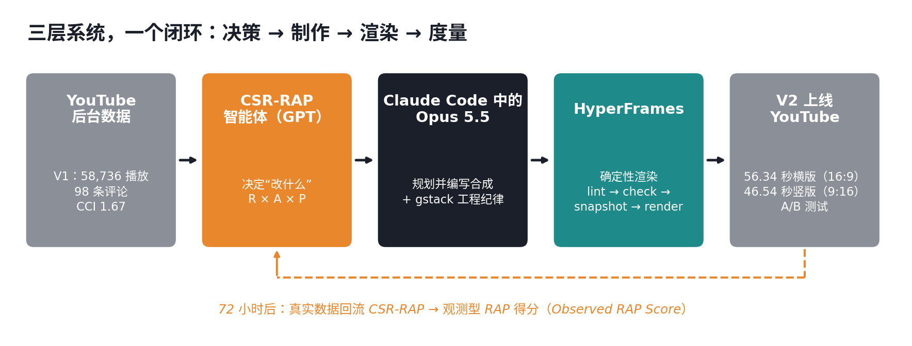
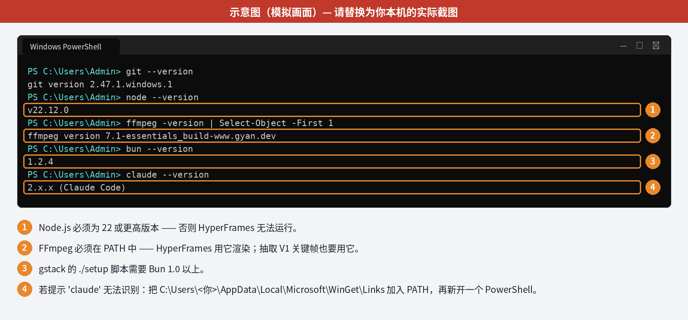
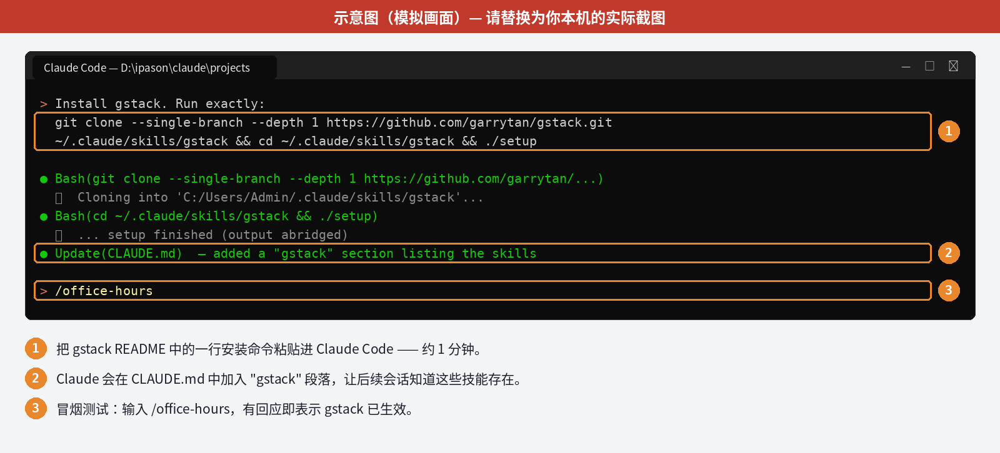
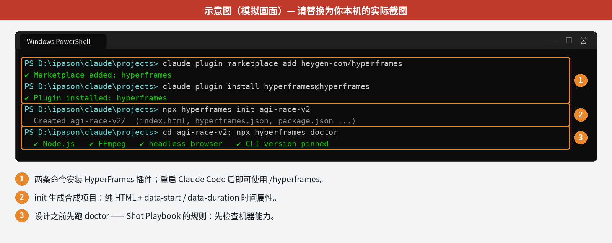
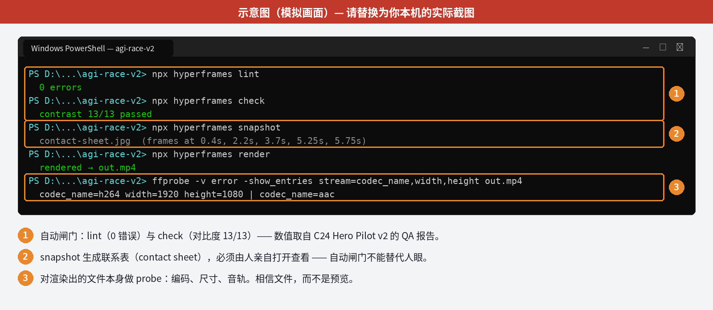
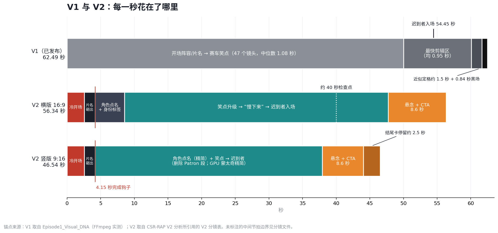
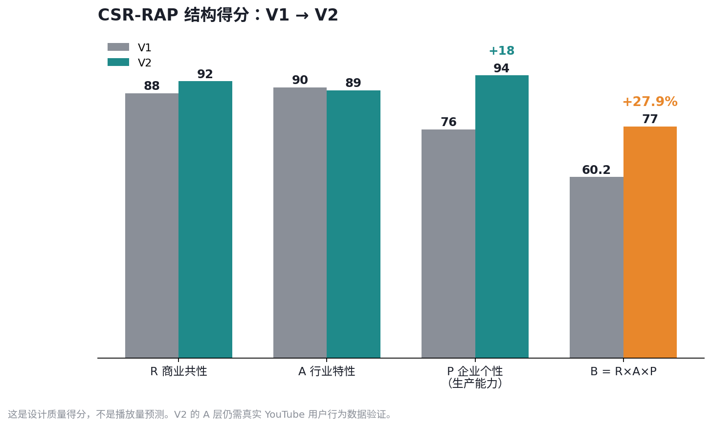

# gstack 教程 #5 —— 从 YouTube 后台数据到一条重新设计的短视频

### CSR-RAP 智能体 × Claude Opus 5.5 × HyperFrames：AGI Race V2 是如何做出来的

> English: [TUTORIAL.md](TUTORIAL.md) · Word 备忘录与幻灯片：[`dist/`](dist/)

**学完之后你能做到：** 拿一条已经在 YouTube 上发布的 Short，把它的真实后台数据
转化为可量化的诊断（CSR-RAP）；再把诊断转化为 Claude Opus 5.5 可执行的制作简报；
由 Opus 5.5 用 HyperFrames **以程序化方式**重建视频；最后把新旧两版放在一起度量，
形成闭环。

**所需时间：** 环境搭建约 10 分钟（其中 gstack 安装约 1 分钟）；精读本教程约 2–3 小时。
教程所记录的实际工作发生在 2026-09-28 一整天内，横跨两台 Windows 11 电脑。

**前置条件：** Windows 11；带 Claude Code 的 Claude 订阅；一个至少发布过一条 Short 的
YouTube 频道；一个 CSR-RAP 分析智能体（本文使用的是一个定制 GPT；任何强大的对话模型，
只要给它 CSR-RAP 框架，都可以承担这一角色）。

**范围先说清楚。** 本教程讲的是 **AGI Race Short 的 V2**——对那条已获得 58,736 次播放的
视频的重新设计版本。它**不是** Episode 2（《OpenAI vs. Anthropic —— 碟中谍版》）：
那一集仍在制作中，质量尚不足以作为教学案例。Episode 2 只在其试制片（pilot）为生产系统
提供了经验教训时才会出现。

---

## 执行摘要

**核心观点：** *真正的杠杆不是更好的 prompt，而是把工作拆分给三个职责不同的系统。*
策略层决定“改什么”，智能体层把改动写出来，确定性渲染层保证每一次都精确地实现改动。



| 层级 | 工具 | 职责 | 绝对不能做的事 |
|---|---|---|---|
| 决策 | CSR-RAP 智能体（GPT） | 把数据转化为带分数、按优先级排序的改动清单 | 编造它看不到的平台数据 |
| 制作 | Claude Code 中的 Claude Opus 5.5 + gstack | 规划、编写并验证合成（composition） | 只给别的生成器写 prompt，然后碰运气 |
| 渲染 | HyperFrames | 可任意跳帧（seek-safe）的 HTML → MP4 渲染；时间、文字、裁切、音频全部精确 | 被要求凭空生成写实人物 |

**三个结论：**

1. **诊断是量化的。** V1 得分 R 88 × A 90 × P 76 → B = 0.602。播放量证明了选题成立（R × A），
   但每千次播放仅 1.67 条评论，说明转化没有成立。
2. **重建是结构性的，而不是表面修饰。** V2 把最强笑点放到第 0 秒，在 4.15 秒内完成钩子，
   用角色身份标签取代“认脸”，为 9:16 逐镜头重新构图，并以通往 Episode 2 的桥段收尾。
   横版 56.34 秒（−9.8%），竖版 Short 46.54 秒（−25.5%）。
3. **在最关键的地方，结论仍未被证明。** CSR-RAP 给 V2 打出 B = 0.770（结构质量 +27.9%），
   但这是设计得分。观众是否真的表现更好，仍是一个进行中的 A/B 测试；第 9 部分说明如何得出结论。

---

## 第 0 部分 —— 心智模型

**核心经验：** *生成式 AI 制造“不确定的像素”；HyperFrames 控制“确定的信息”。
凡是必须 100% 正确的东西，都放到“确定”的那一侧。*

续集的第一次尝试，把 Opus 5.5 当作文生视频模型的 prompt 写手。每一次生成都像买彩票——
也就是中文创作者说的“抽卡”：不停地抽，直到某一张看起来对，而下一次抽到什么完全不受控制。

HyperFrames 改变了“什么可以被控制”。一个合成就是一份普通 HTML，带有时间属性
（`data-start`、`data-duration`、`data-track-index`）和一条可跳帧的动画时间线。
渲染器**把暂停的时间线逐帧 seek 到目标时刻再截取**，而不是边播放边录屏。
这一个事实，推出了整篇教程所依赖的规则：

> **Seek-safe 测试：** 如果渲染器不渲染任何之前的帧，直接跳到 t = 4.312 秒，
> 这一帧还正确吗？

片名、字幕、角色标签、倒计时、裁切、定格、结尾卡、音效时间点——只要写法正确，都能通过这个测试。
视频模型生成的人脸和手则不能。因此分工如下：

| 必须完全正确 → HyperFrames | 允许变化 → 生成模型或原始素材 |
|---|---|
| 每个节拍的时间，精确到帧 | 写实人物与场景 |
| 所有屏幕文字、字幕与角色标签 | 镜头内部的运动 |
| 每个镜头的 9:16 重新构图 | 纹理与光影细节 |
| 定格、切黑、结尾卡序列 | |
| 音效落点 | |

V2 几乎不需要右栏的任何东西：它的像素在 V1 里已经存在。这正是它适合作为这套系统第一个项目的原因。

**检查点 0**
- [ ] 你能凭记忆说出 seek-safe 测试。
- [ ] 对于一条 Short 中的任何元素，你都能说出它属于哪一栏。

---

## 第 1 部分 —— 在 Windows 11 上搭建工具链（约 10 分钟）

**核心经验：** *在设计任何东西之前，先检查机器。* HyperFrames Shot Playbook 记录过一次
真实返工：先设计了环境音乐，后来才发现这台电脑上的音频素材库不可用。

### 1.1 前置软件

打开 **PowerShell**，安装缺少的部分：

```powershell
winget install --id Git.Git -e
winget install --id OpenJS.NodeJS -e          # HyperFrames 需要 Node.js 22 或以上
winget install --id Gyan.FFmpeg -e            # HyperFrames 用 FFmpeg 渲染
powershell -c "irm bun.sh/install.ps1 | iex"  # gstack 的 setup 需要 Bun 1.0+
```

关闭 PowerShell，**新开**一个窗口并验证：

```powershell
git --version; node --version; ffmpeg -version | Select-Object -First 1; bun --version; claude --version
```



*本教程的四张截图均为**带标注的示意图（模拟画面）**。若你 fork 本仓库并公开发布，
请替换为你本机的真实截图。*

> **我们实际踩过的 Windows 坑：** `'claude' 不是内部或外部命令`。WinGet 把 Claude Code
> 装在了 `C:\Users\<你>\AppData\Local\Microsoft\WinGet\Links`，而该目录不在 PATH 中。
> 执行一次以下命令，然后新开 PowerShell：
>
> ```powershell
> $p = "$env:LOCALAPPDATA\Microsoft\WinGet\Links"
> [Environment]::SetEnvironmentVariable("Path", [Environment]::GetEnvironmentVariable("Path","User") + ";$p", "User")
> ```

### 1.2 安装 gstack（约 1 分钟）

gstack 是 Garry Tan 开源的一组 Claude Code 技能，把一个 Claude Code 会话变成一支虚拟团队：
CEO 评审、工程评审、设计评审、QA、安全、发布。在本项目中它提供的是**纪律**：
质疑前提、锁定计划、评审结果。

在项目文件夹中启动 Claude Code（`claude`），粘贴下面这段指令——
即 gstack README 中的官方一行安装命令：

```text
Install gstack: run
git clone --single-branch --depth 1 https://github.com/garrytan/gstack.git ~/.claude/skills/gstack && cd ~/.claude/skills/gstack && ./setup
then add a "gstack" section to CLAUDE.md that lists the available skills.
```

在 Windows 上，Claude Code 通过 Git Bash 执行这条命令，这也是 Git 为前置条件的原因。
冒烟测试：输入 `/office-hours`，有回应即表示 gstack 已生效。



### 1.3 安装 HyperFrames

在 PowerShell 中：

```powershell
claude plugin marketplace add heygen-com/hyperframes
claude plugin install hyperframes@hyperframes
```

重启 Claude Code 后即可使用 `/hyperframes`。它是一个**路由器**：读取任务并分发到合适的工作流。
按照 Shot Playbook：约 10 秒以内、无旁白、以动效本身为信息的内容走 `/motion-graphics`；
更长的多场景作品（例如 46–56 秒的 Short）走 `/general-video`。

新建项目，并在任何设计工作**之前**运行 doctor：

```powershell
npx hyperframes init agi-race-v2
cd agi-race-v2
npx hyperframes doctor
```



在 `package.json` 中锁定 CLI 版本以保证可复现。本教程背后的项目锁定的是
HyperFrames **0.8.79**。

### 1.4 验证有效的目录结构

```text
D:\ipason\claude\projects\agi-race\
├── CLAUDE.md                        # gstack 段落 + 项目规则
├── source\AGI_Race_V1.mp4           # 已发布的 V1（只读）
├── source\AGI_Race.srt
├── analysis\Episode1_Visual_DNA.md  # 第 3 部分产出
├── analysis\Episode1_Visual_DNA\    # 24 张带标注的关键帧
├── playbook\HyperFrames_Shot_Playbook.md
├── briefs\CSR-RAP_V1_diagnosis.md   # 第 2 部分产出
└── agi-race-v2\                     # HyperFrames 项目（第 6 部分）
```

保护原始素材：在 Claude Code 中执行 `/freeze agi-race-v2`，把编辑范围锁定在新项目内，
V1 与分析文件就不会被误改。

**检查点 1**
- [ ] `node --version` 显示 v22 或以上；`ffmpeg` 与 `bun` 均可调用。
- [ ] `/office-hours` 有回应（gstack 生效）。
- [ ] `/hyperframes` 有回应，`npx hyperframes doctor` 无报错。

---

## 第 2 部分 —— 原始数据 → CSR-RAP 诊断

**核心经验：** *播放量告诉你选题成立；转化率告诉你产品是否成立。* 两者都要看。

### 2.1 导出什么

在 **YouTube Studio → 该视频 → 数据分析** 中记录：

| Short（9:16） | 长视频 / 16:9 |
|---|---|
| 观看次数、在 Feed 中展示次数 | 展示次数、点击率（CTR） |
| 观看 vs. 划走（选择观看比例） | 平均观看时长（AVD） |
| 平均观看时长、平均观看百分比 | 留存曲线 |
| 点赞、评论、分享、新增订阅 | 新增订阅 |

对 V1，我们手上是频道主报告的两个数字：**58,736 次播放、98 条评论**——频道第一次破圈。
由此导出一个此后持续追踪的指标：

$$\text{CCI（评论转化指数）} = \frac{\text{评论数}}{\text{播放量}} \times 1000 = \frac{98}{58{,}736}\times1000 = 1.67$$

### 2.2 运行 CSR-RAP 智能体

CSR-RAP 把商业结果看作三层的乘积：**R**（商业共性——任何产品都必须遵守的规律）、
**A**（行业特性——这个市场的结构，此处即 YouTube Shorts）、**P**（企业个性——创作者自身的生产能力）。
由于 **B = R × A × P**，任何一层偏弱都会压低整体结果。

把 [`starter/prompts/01_csr_rap_diagnosis.md`](starter/prompts/01_csr_rap_diagnosis.md)
中的完整 prompt 粘贴给你的 CSR-RAP 智能体。这就是 V1 实际使用的 prompt：
标题、简介、章节时间戳、出场人物，以及上面的两个数字。

### 2.3 得到的结果

| 层级 | V1 得分 | 诊断 |
|---|---|---|
| R —— 商业共性 | 88 | 认知压缩有效：复杂的 AI 竞赛被压缩成一场沙漠赛车 |
| A —— 行业特性 | 90 | 热门话题、辨识度高的人物、与 Shorts 高度契合 |
| P —— 生产能力 | 76 | 视觉连贯、升级节奏好，但因果链弱、9:16 表现差 |
| **B = R × A × P** | **0.602** | **R × A 共振已验证；转化（CCI 1.67）未验证** |

**检查点 2**
- [ ] 你能为自己任何一条视频计算 CCI。
- [ ] 你能解释为什么乘法模型会惩罚最弱的一层。

---

## 第 3 部分 —— 改之前先测量：视觉 DNA

**核心经验：** *没有测量，就无法保住有效的部分。*“把它做得更好”不是简报；
“保留高潮前 0.95 秒的剪辑区块；修复在 9:16 中失效的四件事”才是。

在 Claude Code 中让 Opus 5.5 用 FFmpeg 对 V1 做画像。prompt 见
[`starter/prompts/02_visual_dna.md`](starter/prompts/02_visual_dna.md)。它运行的核心命令如下：

```powershell
# 技术画像
ffprobe -v error -show_entries format=duration:stream=codec_name,width,height,r_frame_rate source\AGI_Race_V1.mp4
# 硬切检测（scene 分数 > 0.3），带时间戳
ffmpeg -i source\AGI_Race_V1.mp4 -vf "select='gt(scene,0.3)',showinfo" -vsync vfr -f null - 2> analysis\cuts.log
# 每秒一张候选帧供人工审阅
ffmpeg -i source\AGI_Race_V1.mp4 -vf fps=1 analysis\candidates\f_%03d.jpg
```

视觉 DNA 的发现（全部由 FFmpeg 实测）：

| 维度 | 发现 | 对 V2 的含义 |
|---|---|---|
| 时长 | 62.49 秒 | 横版可压缩约 6 秒，Short 约 16 秒 |
| 节奏 | 46 个硬切 / 47 个镜头；镜头中位数 1.08 秒；46 个中 20 个短于 1 秒 | 保留快剪语法 |
| 高潮 | 最快区间约 50–60 秒，平均镜头 0.95 秒 | 保留“高潮前加速” |
| 结尾 | 60.1 秒起约 1.5 秒近似定格，随后 0.84 秒黑场 | 近似定格 + 黑场即目标结尾 |
| 色彩 | 低饱和（约 9–20）；绿色 GPU 光束是唯一强调色 | 保持克制 |
| 9:16 | 居中裁切会切掉片名、群像远景、最终定格和**所有字幕**；特写能保留 | 9:16 必须重新导演，而不是裁切 |
| 反作用力 | “慢下来”以全片最大的特写出现，紧挨高潮之前 | 保留为高潮前最后一个节拍 |

这里还确立了一条延续到 V2 的规则：**人物按角色记录，而不是按真实姓名。**

**检查点 3**
- [ ] 你有一份包含实测节奏、结尾和 9:16 结论的视觉 DNA 文件。
- [ ] 你计划的每一处 V2 改动，都能追溯到其中某一行。

---

## 第 4 部分 —— 走过的弯路，以及它教会我们的事

**核心经验：** *一个只给别的生成器写 prompt 的智能体，本质上仍在赌博。*
收录这一部分，是因为这次失败比一次顺利的运行更有教育意义。

续集（Episode 2）的第一版计划中，Opus 5.5 产出了一套严谨的方案包：分镜 prompt、
连续性手册、试制计划与评分卡。在家里的电脑上运行时，它在自己设置的闸门处停了下来：

> *“Entry gate: FAIL. Nothing has been generated yet. The project folder has
> no reference images, so none of the entry conditions can be scored…
> Numbers for frames nobody has generated would be invented.”*
>
> （入口闸门：未通过。尚未生成任何内容；项目中没有参考图，所以无法对任何入口条件打分……
> 给尚未生成的画面打分，等于编造数字。）

有两点值得注意。第一，**闸门起作用了**：Opus 拒绝为不存在的素材填写分数，这正是我们想要的行为。
第二，方案对“生成人脸”的依赖，让整条流水线都卡在最不可控的那一步。

转向：安装 HyperFrames，让 Opus 从**写 prompt** 变成**直接制作**。第一条 HyperFrames 短片
（6 秒、1920×1080、30 fps、5 条音轨、15.6 秒完成渲染）以及随后的 C24 结构试制片证明了可控层是成立的：
在 C24 中直接跳到 2.4、3.4、4.5、5.3 秒，倒计时都正确显示，无需先播放之前的帧；切黑精确落在第 139 帧；lint 0 错误，check 对比度 13/13 通过。
同一个试制片也暴露了边界：**R 0.82 与 A 0.75 被占位人物拖累，而不是被结构拖累。**生成层仍然是风险所在。

这正是 V2 成为正确下一步的原因：像素已经存在，而每一处改动都落在可控的一侧。

**检查点 4**
- [ ] 你能解释为什么“Entry gate: FAIL”是流程的成功。
- [ ] 你能指出是哪一层拖低了 C24 试制片的得分。

---

## 第 5 部分 —— HyperFrames Shot Playbook：已经写死的规则

**核心经验：** *出过一次错就写下来，让智能体永远不会犯第二次。*
Playbook 来自第一条真正的 HyperFrames 短片，它的规则如今写进每一份 Opus 5.5 简报。

| # | 规则 | 原因 |
|---|---|---|
| 1 | 先经 `/hyperframes` 路由；≤10 秒动效 → `/motion-graphics`，多场景 → `/general-video` | 路由器知道该走哪条工作流 |
| 2 | 设计前先运行 `doctor` 并查看时间线 | 避免为本机无法使用的素材做设计 |
| 3 | 先搜索组件库再动手（例如复用了 `titlecard-lockup`，而非重写） | 复用胜过重新发明 |
| 4 | 任何状态在任意 seek 时刻都必须正确：禁止挂钟计数器、禁止 Web Audio 图、禁止与第一段冲突的第二个 `fromTo` | 渲染器是跳帧，不是播放 |
| 5 | 超过约 4 秒的停留加一个单向微动（如 scale 1 → 1.008），禁止循环或 yoyo | 完全静止的画面会被当成卡住 |
| 6 | 关键文字放在画面中间三分之一 | 必须在 9:16 裁切中保留 |
| 7 | 验证链：**lint → check → snapshot/联系表 → render → ffprobe**，然后由人打开联系表 | 自动闸门不能替代人眼 |



再记住 C24 QA 的一个事实：第二次渲染与第一次相比，144 帧中有 61 帧完全相同，其余 83 帧的差异肉眼不可见
（PSNR ≥ 50 dB）。输出是**视觉确定性的，而不是逐比特一致**。不要设计一个要求哈希完全相同的 QA 步骤。

**检查点 5**
- [ ] 你项目的 `CLAUDE.md` 中包含这七条规则。
- [ ] 你知道哪一道闸门是“人”。

---

## 第 6 部分 —— 给 Opus 5.5 的 V2 简报

**核心经验：** *把测量结果、规则和停止条件交给智能体，创意决策就变得可检验。*

### 6.1 先质疑前提（gstack）

在发送制作 prompt 之前，先花十分钟使用 gstack：

```text
/office-hours      → V2 值得做吗？还是应该把全部精力放在 Episode 2？
                     V2 必须回答的唯一问题是什么？（采用的答案：
                     “HyperFrames 的包装，能否让同样的内容带来更好的观众行为？”）
/plan-ceo-review   → 范围：HOLD（维持）。只做重剪，不生成新素材。
/plan-eng-review   → 一套共享的 token / 字体系统，驱动两个合成（16:9 横版、9:16 竖版）。
```

这不会改变 HyperFrames 渲染什么，但能避免最昂贵的错误：把一个错误的 V2 做得很好。

### 6.2 制作 prompt

完整、可直接复制粘贴的 prompt 见
[`starter/prompts/03_opus55_v2_build.md`](starter/prompts/03_opus55_v2_build.md)。其结构如下：

| 模块 | 内容 |
|---|---|
| 角色与目标 | 资深 Shorts 剪辑师兼 HyperFrames 工程师；重新设计 V1，不生成新素材 |
| 输入 | V1 的 MP4 + SRT、视觉 DNA、Shot Playbook、CSR-RAP 诊断 |
| 改动清单（来自 CSR-RAP） | 以最强笑点冷开场；4.15 秒内完成片名砸出；角色标签；删除听不清的台词；9:16 单独导演；通往 Episode 2 的结尾卡 |
| 保留清单（来自视觉 DNA） | 快剪语法；高潮前加速；“慢下来”作为最大特写；悬而未决的飞跃；近似定格 → 黑场 |
| 硬性规则 | Playbook 的七条规则 |
| 产出 | 分镜表、16:9 横版、9:16 竖版、QA 报告、联系表 |
| 停止条件 | 两版渲染和 QA 报告完成即停；不得上传；所有构图改动须标出，交人工签字 |

### 6.3 制作产出

- **43 个镜头的横版**（16:9，56.34 秒）与 **35 个镜头的竖版 Short**（9:16，46.54 秒）。
- **逐镜头竖版导演**：每个镜头有独立的水平偏移，群像镜头使用横移（pan），片名重排为三行，
  字幕放在画面 60% 高度，顶部栏放系列标题，底部与右侧留出平台 UI 安全区。
- **角色标签系统**（THE GPU DEALER、THE LITIGATOR、THE ACCELERATOR、THE SAFETY GUY、
  THE OPEN-SOURCE GUY、THE LATE ENTRANT），观众无需认出任何人也能跟上故事。
- **音频接缝交叉淡化**、遮幅（letterbox）系统、可复用 token，以及按顺序出现的结尾卡：
  *TO BE CONTINUED → EPISODE 2 → SUBSCRIBE*。

制作完成后，对合成代码运行 `/review`（gstack）。它就是普通的 HTML/JS，应当接受与任何代码相同的缺陷审查。

**检查点 6**
- [ ] 你的简报有改动清单和保留清单，每一条都能追溯来源。
- [ ] 你的简报写明了智能体何时必须停止。

---

## 第 7 部分 —— V2 解剖：时间结构图

**核心经验：** *钩子是一笔预算。* V2 用 Short 的 8.9%（46.54 秒中的 4.15 秒），
依次交付了奇观、笑点和前提。



顺序从 **背景 → 笑点** 变成了 **笑点 → 好奇 → 背景**：

| 段落 | V2 时间 | 观众得到什么 |
|---|---|---|
| 冷开场 | 0–2.55 秒 | 最强笑点先行：*“Eat my lawsuits, nonprofit boy!”* |
| 片名砸出 | 2.55–4.15 秒 | 前提：这是 AGI 竞赛，以讽刺喜剧呈现 |
| 角色点名 | 4.15–8.53 秒 | 所有参赛者，按角色贴上标签 |
| 升级 | 8.53 秒起 | 笑点层层升级；“慢下来”的反作用力；迟到者入场 |
| 悬念 + CTA | 最后 8.6 秒 | 悬而未决的飞跃 → *TO BE CONTINUED → EPISODE 2 → SUBSCRIBE* |

### V1 → V2 量化改进图

| 指标 | V1 | V2 | 判断 |
|---|---|---|---|
| 主版本时长 | 62.49 秒 | 56.34 秒 | −9.8% |
| Short 时长 | — | 46.54 秒 | 比 V1 短 25.5% |
| 开场 | 阵容 / 片名 | 最强笑点先行 | 明显升级 |
| 钩子完成 | 较慢 | 4.15 秒 | 更强 |
| 英语观众可及性 | 较低 | 英文字幕与标签 | 大幅升级 |
| 角色理解 | 依赖“认脸” | 明确的角色标签 | 大幅升级 |
| 9:16 | 多处失效 | 逐镜头重新构图 | 大幅升级 |
| 结尾 | 悬而未决的飞跃 | 悬而未决的飞跃 + Episode 2 桥段 | 商业价值升级 |
| CTA 系统 | 弱 / 泛泛 | TO BE CONTINUED → Episode 2 → Subscribe | 明显升级 |
| 生产方式 | 视频生成 | 可编程的 HyperFrames 重剪 | P 层显著提升 |

**竖版 Short 是一个独立产品，而不是裁切版。** 它删掉的内容是有选择的，而不是平均砍：
部分角色点名镜头、整个 Patron 段落、部分 GPU 蒙太奇。完整保留因果链：
**钩子 → 对手 → 笑点 → 安全反作用力 → 迟到者 → 悬崖。**

**检查点 7**
- [ ] 你能为自己的视频画出时间条，并标出钩子边界。
- [ ] 你能说出 Short 删了什么，以及为什么故事依然成立。

---

## 第 8 部分 —— 用 CSR-RAP 重新打分（并诚实地解读分数）

**核心经验：** *设计得分是关于观众行为的假设，而不是证据。*



| 层级 | V1 | V2 | 变化原因 |
|---|---|---|---|
| R —— 商业共性 | 88 | 92 | 笑点先行；角色标签去除“认脸”门槛；删除无效台词 |
| A —— 行业特性 | 90 | 89 | Shorts 结构更好，但 CTA 长度未经检验；在数据回来之前压着打分 |
| P —— 生产能力 | 76 | 94 | 分析 → 提取 DNA → 重新设计 → 渲染，取代“写 prompt → 碰运气” |
| **B** | **0.602** | **0.770** | **结构质量 +27.9%** |

$$B_{V2} = 0.92 \times 0.89 \times 0.94 = 0.770$$

最重要的变化是*哪一对层级最强*。V1 最强的是 R × A：选对了热点。V2 最强的是 **R × P = 0.865**：
既知道观众对什么有反应，*又*拥有一套能据此重新包装内容的系统。后者会在一集又一集中复利累积，前者不会。

+27.9% **不**意味着 V2 会多获得 27.9% 的播放量。

**检查点 8**
- [ ] 你能手算 V1 与 V2 的 B 值。
- [ ] 你能解释设计得分与观测得分的区别。

---

## 第 9 部分 —— 闭环：去度量，而不是再改片

**核心经验：** *同一内容的两次上传，就是一次自然实验。别用改片破坏它。*

V2 上传了两次：9:16 Short（`youtube.com/shorts/mEztESwn7mI`）和 16:9 横版
（`youtu.be/6MnhRmSR_TA`）。它们回答的唯一问题是：

> **HyperFrames 的包装，能否让同样的底层内容带来更好的观众行为？**

**规则 1：两个文件冻结 24–72 小时。** 之后按第 2.1 节的指标分别收集数据。

**规则 2：检查留存曲线上的三个时间窗口。**

| 窗口 | 问题 | 若未通过 |
|---|---|---|
| 0–4.15 秒 | 冷开场能否阻止划走？ | 测试另一个开场笑点 |
| 约 40 秒 | “慢下来 → 迟到者”能否再次拉高注意力？ | 收紧其之前的升级段落 |
| 最后 8.6 秒 | 悬念 + 结尾卡是在增加订阅，还是导致提前退出？ | 如果结尾卡处出现明显留存断崖，**且**订阅转化没有提升，把结尾卡停留从约 2.5 秒缩短到约 1–1.5 秒 |

**规则 3：用观测型 RAP 得分（Observed RAP Score）取代主观打分。** CSR-RAP 智能体提出了五个度量。
下表的定义是**建议的**操作化方式，使用前请与你的智能体确认：

| 度量 | 建议定义 |
|---|---|
| 钩子效率（Hook Efficiency） | 选择观看比例（Short）或点击率（16:9） |
| 留存效率（Retention Efficiency） | 平均观看百分比 |
| 互动转化（Engagement Conversion） | CCI = 评论 / 播放 × 1000（V1 基线 1.67；目标 > 2.5） |
| 订阅转化（Subscriber Conversion） | 每千次播放新增订阅 |
| 竖版优势（Vertical Format Advantage） | Short 平均观看百分比 ÷ 横版平均观看百分比 |

把真实数字交回 CSR-RAP 智能体。它必须回答的是：V2 在商业上是否真正超过了 V1 的 58,736 次播放，
而不是 V2 的设计好不好。

**检查点 9**
- [ ] 两个 V2 文件自上传后都未被修改。
- [ ] 你已经定下拉取数据的日期。

---

## 第 10 部分 —— 已知局限与验证欠账

| # | 事项 | 类别 |
|---|---|---|
| L1 | 尚无 V2 的真实数据。本教程中关于 V2 的所有结论都是结构性的 | 验证欠账 |
| L2 | CSR-RAP 分数是模型对设计质量的判断，不是测量值 | 方法局限 |
| L3 | 四张截图为示意图（模拟画面） | fork 公开发布前需替换 |
| L4 | V2 中间节拍（8.53 秒到悬念段之间）的边界见分镜文件，本文未复制 | 有意延后 |
| L5 | HyperFrames 渲染是视觉确定性的，但非逐比特一致（C24 中 144 帧有 61 帧相同） | 已知行为 |
| L6 | Episode 2 的生成层（人物身份、手部、钥匙）尚未验证 | 超出范围；开放风险 |
| L7 | 视频讽刺的是真实公众人物。V2 的角色标签降低了对肖像的依赖，但并未消除；每次发布前请复核平台政策 | 持续风险 |
| L8 | 工具安装命令已于 2026-09-29 对照 gstack 与 HyperFrames 的 README 核实；两个项目迭代很快 | 使用时再核实 |

---

## 第 11 部分 —— 可复用的操作系统

任何一条你想重新设计的 Short，都可以按以下步骤进行：

1. **导出**真实数据，计算 CCI。*（第 2 部分）*
2. 用 CSR-RAP **诊断**：得到 R、A、P 与排序后的改动清单。*（第 2 部分）*
3. **测量**原片：用 FFmpeg 生成视觉 DNA。*（第 3 部分）*
4. 用 `/office-hours` **质疑**前提，用 `/plan-ceo-review` 设定范围。*（第 6.1 节）*
5. 给 Opus 5.5 **下简报**：改动清单、保留清单、Playbook 规则、停止条件。*（第 6.2 节）*
6. 在 HyperFrames 中**制作并验证**：lint → check → snapshot → render → ffprobe → 人眼。*（第 5 部分）*
7. 用 CSR-RAP **重新打分**，并标注为设计得分。*（第 8 部分）*
8. **上传、冻结、度量** 72 小时，计算观测型 RAP 得分。*（第 9 部分）*
9. 把结论**反馈**到下一集的简报中。

---

## 故障排查

| 现象 | 原因 | 解决 |
|---|---|---|
| `'claude' 不是内部或外部命令` | WinGet Links 目录不在 PATH | 按 1.1 节修复；新开 PowerShell |
| Windows 上 gstack `./setup` 失败 | 在 PowerShell 中运行，或缺少 Bun | 在 Claude Code（Git Bash）中运行；安装 Bun 后重试 |
| 找不到 `/hyperframes` | 安装插件后未重启 Claude Code | 退出并重新启动 `claude` |
| HyperFrames 启动报错 | Node.js 低于 22 | `winget upgrade OpenJS.NodeJS`；新开终端 |
| 渲染失败，提示找不到 ffmpeg | FFmpeg 不在 PATH | 用 winget 重装；新开终端；运行 `npx hyperframes doctor` |
| 倒计时/计数器在预览中正确、渲染中错误 | 使用了挂钟逻辑，不满足 seek-safe | 只从时间线时间推导状态（Playbook 规则 4） |
| `lint` 报文件位置问题 | 例如竖版合成放在项目根目录 | 移动到 lint 期望的位置 |
| `check` 报对比度问题 | 例如暗角压暗了关键文字 | 提亮文字或减弱暗角；重新 check |
| 第二次渲染与第一次不同 | 正常：视觉确定性，非逐比特一致 | 用 PSNR 或肉眼比较，而非哈希 |

---

## 值得保留的纪律

- **先测量，再改动。** 没有 V1 的视觉 DNA，就没有 V2。
- **确定的信息放进确定性层。** 文字、时间、裁切、音频都属于 HyperFrames。
- **让闸门大声失败。**“Entry gate: FAIL”省下了一天编造出来的数字。
- **把 9:16 当作产品，而不是裁切。**
- **按类型标注分数。** 设计得分与观测得分永远不放在同一列。
- **实验期间不改片。**

---

## 附录 A —— 命令速查

```powershell
# 前置软件
winget install --id Git.Git -e
winget install --id OpenJS.NodeJS -e
winget install --id Gyan.FFmpeg -e
powershell -c "irm bun.sh/install.ps1 | iex"

# gstack（在 Claude Code 中执行）
git clone --single-branch --depth 1 https://github.com/garrytan/gstack.git ~/.claude/skills/gstack && cd ~/.claude/skills/gstack && ./setup

# HyperFrames
claude plugin marketplace add heygen-com/hyperframes
claude plugin install hyperframes@hyperframes
npx hyperframes init <name>
npx hyperframes doctor
npx hyperframes preview
npx hyperframes lint
npx hyperframes check
npx hyperframes snapshot
npx hyperframes render

# 验证
ffprobe -v error -show_entries format=duration:stream=codec_name,width,height,r_frame_rate out.mp4
```

使用到的 gstack 技能：`/office-hours`、`/plan-ceo-review`、`/plan-eng-review`、
`/freeze`、`/review`、`/retro`。

## 附录 B —— 双语术语表

| English | 中文 | 本文含义 |
|---|---|---|
| CSR-RAP | 商业三性（CSR-RAP） | B = R × A × P 商业结果框架 |
| Rules of Business (R) | 商业共性 | 任何产品都必须遵守的规律 |
| Attributes of Industry (A) | 行业特性 | 该市场（YouTube Shorts）的结构 |
| Personality / capability (P) | 企业个性 | 创作者自身的生产能力 |
| CCI | 评论转化指数 | 每千次播放的评论数 |
| Visual DNA | 视觉 DNA | 原片的实测画像 |
| Seek-safe | 可任意跳帧（seek-safe） | 在任意直接跳转的时刻都正确 |
| Cold open | 冷开场 | 笑点先于片名出现 |
| Role tag | 角色身份标签 | 取代“认脸”的屏幕标签 |
| End-card | 结尾卡 | 结尾的 CTA 序列 |
| Observed RAP Score | 观测型 RAP 得分 | 基于真实行为数据计算的 RAP |
| 抽卡 (gacha) | 抽卡 | 反复生成，直到随机结果看起来合适 |

## 附录 C —— 完成标准（Definition of Done）

- [ ] 两个 V2 文件均已渲染、probe，并由人分别在手机（9:16）和显示器（16:9）上检查。
- [ ] 联系表已审阅；每一处构图改动均已签字确认。
- [ ] QA 报告列出 lint、check、snapshot 与 ffprobe 结果。
- [ ] CSR-RAP 重新打分已记录，**并标注为设计得分**。
- [ ] 两次上传均已冻结；数据拉取日期已确定。
- [ ] 在定稿 Episode 2 简报之前，已计算并归档观测型 RAP 得分。

---

*本教程中的每一个数字都可以在 [docs/SOURCES.md](docs/SOURCES.md) 中追溯来源。*
